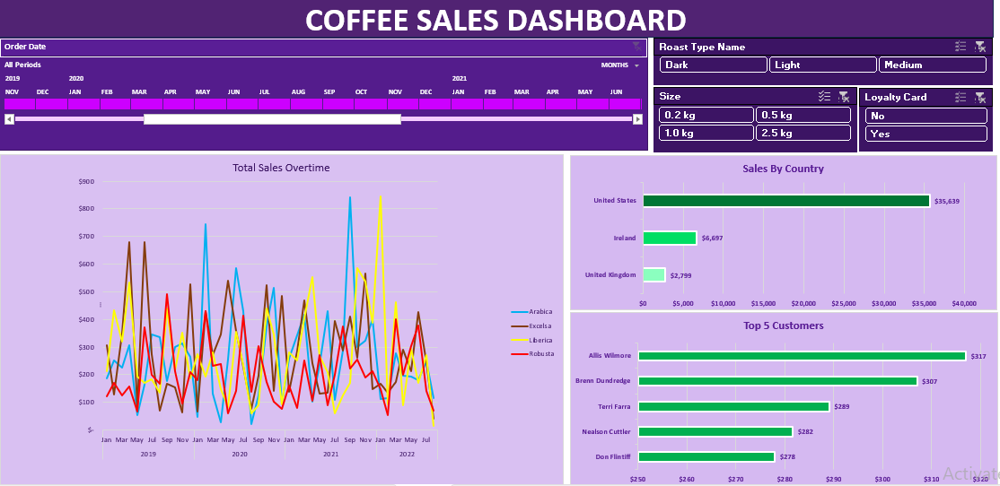

# ☕ Coffee Sales Dashboard

## 📌 Project Overview
I developed the Coffee Sales Dashboard as a data analytics project to transform raw sales data into clear, actionable business insights. The goal was to design an interactive dashboard that allows users to explore sales trends, customer behavior, and product performance in a simple and visually engaging way.

In this project, I:
- Collected, cleaned, and structured the sales dataset for analysis  
- Designed and built the dashboard in Power BI to enable interactive filtering by time, geography, roast type, package size, and loyalty card usage
- Conducted exploratory analysis to uncover patterns such as seasonal sales peaks, regional performance differences, and product preferences
- Communicated insights clearly to support **data-driven decision-making**  

## 🖼️ Dashboard Preview

  

## 🔑 Key Insights
- 📈 **Sales Trends**: Revenue shows fluctuations over time, with noticeable peaks in **mid-2021**.  
- 🌍 **Regional Performance**: The **United States** leads in sales, followed by **Ireland** and the **United Kingdom**.  
- 🫘 **Product Preferences**:  
  - **Dark roast coffee** is the most popular across customers.  
  - Smaller package sizes (**0.2 kg and 0.5 kg**) sell more frequently.  
- 👥 **Customer Analysis**:  
  - A small group of **top customers** contributes a large portion of total sales.  
  - **Loyalty card users** tend to make higher and more consistent purchases.  

---

## 📝 Recommendations
Based on the insights from the dashboard, I recommend:  
1. **Focus marketing campaigns** on top customers and loyalty card users to increase retention.  
2. **Expand U.S. sales strategies** while exploring opportunities to grow the market in Ireland and the UK.  
3. **Promote dark roast coffee** as the flagship product, while experimenting with new blends to attract diverse preferences.  
4. **Optimize packaging strategy** by ensuring smaller package sizes remain widely available, as they drive higher sales frequency.  
5. **Leverage seasonal peaks** by aligning promotions and product launches with high-demand periods.  

---

## ⚙️ Tools Used
- **Microsoft Excel** → Data cleaning, analysis, and dashboard creation  
- **GitHub** → Project documentation and sharing  

---

## 👨‍💻 About Me
This project reflects my skills in **data analysis, Excel dashboard design, and business storytelling**.  
